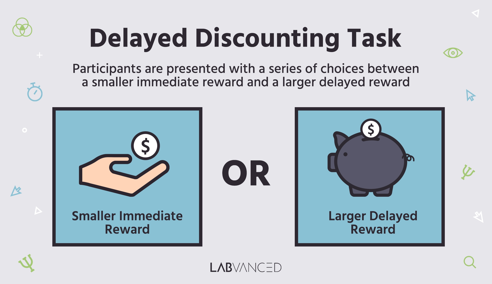

# 🧩 CABLAB-Delay-Discounting


This repository contains the full **Delay Discounting (DD)** experimental and analysis pipeline developed by the **CABLab** for use in behavioral and neuroimaging studies examining **impulsivity, temporal discounting, and social conformity**.  

It integrates task design, data decryption, processing scripts, and video-triggered social influence manipulations into one reproducible workflow.


 🎯 Overview

 

The repository provides both the **experimental implementation** of the Delay Discounting task and all **supporting analysis tools** required to process and interpret the data.  

It supports two complementary paradigms:

1. **Standard Delay Discounting Task** – assesses impulsive decision-making through choices between smaller-sooner vs. larger-later rewards.  
+ Analyses scripts included
2. **Social Conformity Delay Discounting Task** – introduces a **peer observation and conformity manipulation**, examining whether participants adjust discounting behavior when influenced by a fictional peer.

---

## 🧱 Repository Structure

| Folder | Purpose |
|---------|----------|
| **`dd-data/`** | Data conversion and analysis pipeline. Converts raw E-Prime exports → computes indifference averages and discounting rates (`k`, `ln(k)`). |
| **`dd-transform/`** | Handles the **decryption and conversion** of raw E-Prime `.txt` files into structured `.csv` files using the `convert_eprime` package. |
| **`dd-conformity-task/`** | Implements the **social conformity video trigger** version of the DD task. After calculating each participant’s indifference average, it launches a corresponding peer-video showing increasingly impulsive choices. |
| **`dd-formulas.md`** | Documents the core **mathematical logic** behind all DD computations (Indifference Average, k-value, ln(k)) and provides interpretive guidelines. |
| **`dd-desktop-setup/`** | Contains the executable **Python** and **.bat launcher** files used by research assistants to run the conformity task locally without code modification. |


## 🧪 Research Context

The CABLab Delay Discounting pipeline enables investigation of:
- **Individual differences** in impulsive decision-making.  
- **Effects of social context** on temporal discounting and conformity.  
- **Behavioral correlates of reward valuation** in developmental and neuroimaging studies.

The **social conformity variant** includes a controlled deception element: participants are led to believe they are being observed by a peer and then view a prerecorded “peer” making systematically more impulsive choices before repeating the task.


## Workflow

1. **Data Collection (E-Prime)**  
   Participants complete the DD task on E-Prime, producing raw `.txt` output files.

2. **File Consolidation**  
   Run `dd-data/dd-datafile-org.py` to flatten the nested participant folders into one directory.

3. **Decryption & Conversion**  
   Run `dd-transform/dd--eprim-to-csv.py` to convert `.txt` files to `.csv`.

4. **Metric Computation**  
   Use `dd-data/indiff.avg_k_calculation.py` to calculate:
   - Average indifference point (`Indiff_Avg`)
   - Discount rate (`k`)
   - Log-transformed discounting (`ln_k`)

**This can be run on both alone and social output.**

5. **Social Conformity Task Execution**  
   From the desktop interface, launch `dd-desktop-setup/conformity_video_task.py` (or the included `.bat` shortcut).  
   - Enter the participant ID when prompted.  
   - The script locates and converts the participant’s `.txt` file.  
   - Computes `Indiff_Avg`.  
   - Automatically plays the appropriate peer-video in VLC.

   (Neccesary videos are excluded from github repo due to size restrictions, but can be accessed (contact danny.zweben99@gmail.com))

---

## 💻 Requirements

- **Python 3.9+**
- Packages:  
  `pandas`, `tkinter`, `platform`, `subprocess`, `convert_eprime`
- **VLC Media Player** installed at default path for automatic playback  
- Manual install for `convert_eprime`:  
  ```bash
  python -m pip install git+https://github.com/tsalo/convert-eprime.git
